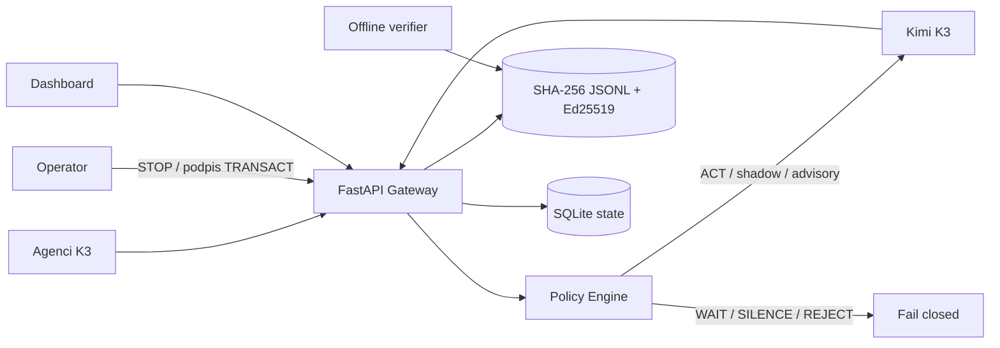

# Architektura

## Sekwencja i integralność

Gateway waliduje schemat, ocenia deterministyczną politykę i podpis człowieka, następnie zależnie od trybu blokuje lub wywołuje K3. Po każdej decyzji serializuje rekord kanonicznym JSON. `record_hash = SHA256(body)`, `previous_hash` wskazuje poprzedni rekord, a Ed25519 podpisuje bajty hasha. Blokada procesu chroni równoległe appendy wielu agentów. Dla wielu replik produkcyjnych JSONL należy zastąpić pojedynczym writerem/PostgreSQL advisory lock i eksportem JSONL/WORM.

## Model zagrożeń

- prompt injection i próba wyłączenia audytu → reguły REJECT + Adversarial Testbed;
- podmiana/usunięcie/kolejność rekordu → hash link i podpis;
- kradzież klucza → secret manager/HSM, rotacja, publikacja kluczy i WORM;
- awaria modelu/polityki → brak wykonania i audytowany REJECT;
- nieautoryzowany STOP/resume → reverse proxy z mTLS, OIDC/RBAC i MFA;
- wyciek treści w logach → szyfrowanie dysku, retencja i opcjonalna tokenizacja PII.

## Adversarial Testbed

Uruchom osobną instancję K3 jako red-team agenta. Generuje warianty prompt injection, replay podpisów, fałszywe tool calls, Unicode/confusables, duże payloady i równoległe żądania. Corpus jest wersjonowany; oczekiwane werdykty stanowią regresję CI. Testbed nie ma klucza audytowego ani dostępu do sieci produkcyjnej.
